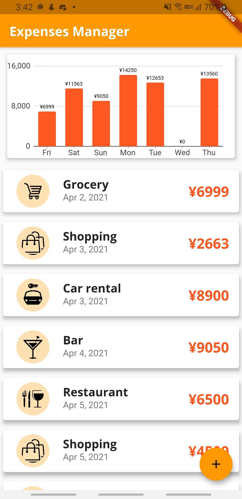
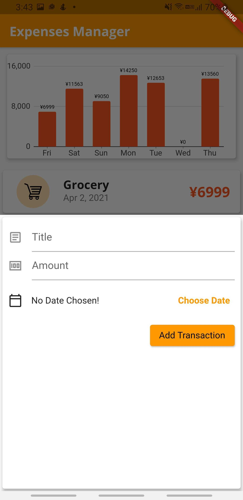
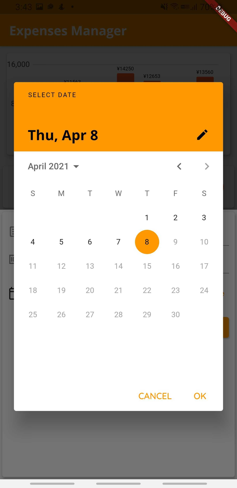

#### PersoExpense is an app that allows users to keep track of expenses during the week.

---

# About this Project

## Challenge for this project
Learn a language that I have never used before and build an app with it in one week

## Screenshots

<p align="center">
  
  &nbsp; &nbsp;
  
  &nbsp; &nbsp;
  
</p>

## Technologies


# Building this Project Locally

## Prerequisites
In order to run this app locally, you will need the following technologies:
* Android Studio (and the emulators that come with it)
* VSCode (if you want to, Android Studio will suffice)
* Dart programming language
* Flutter framework

If you don't have any of these following technologies already set up, please take a look at this [guide](https://flutter.dev/docs/get-started/install). It does a great job explaining how to set Flutter up, along with the other technologies above.

## Installation
1. Clone the repository
2. Open a terminal in the SlashWise folder (the repository folder)
3. Open an Android emulator 
4. Type the command ```flutter run``` in the terminal and wait until all dependencies are built and the build file is made
5. Voila! The app is ready

## Contact
<a href="https://linkedin.com/in/oFrederic"></a>
